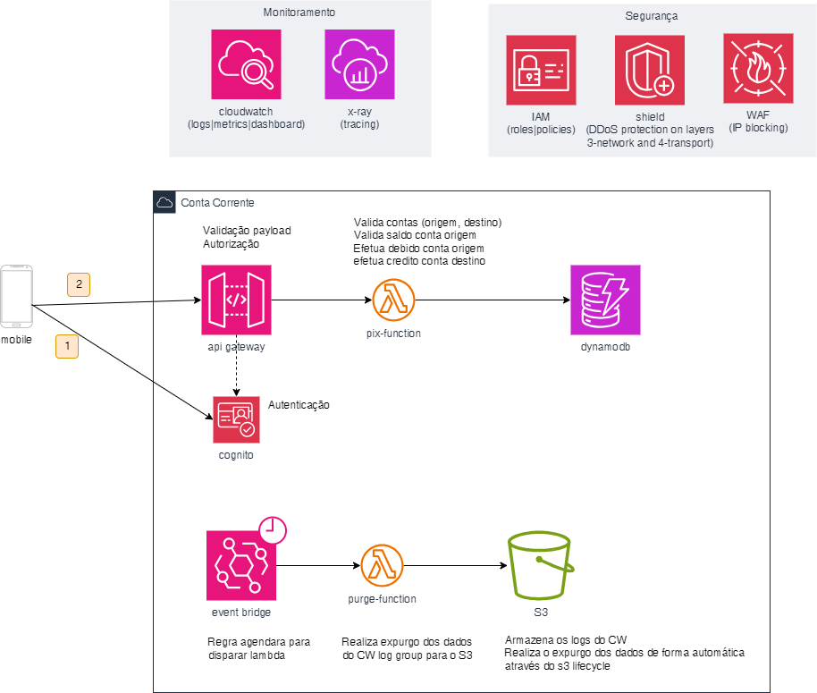
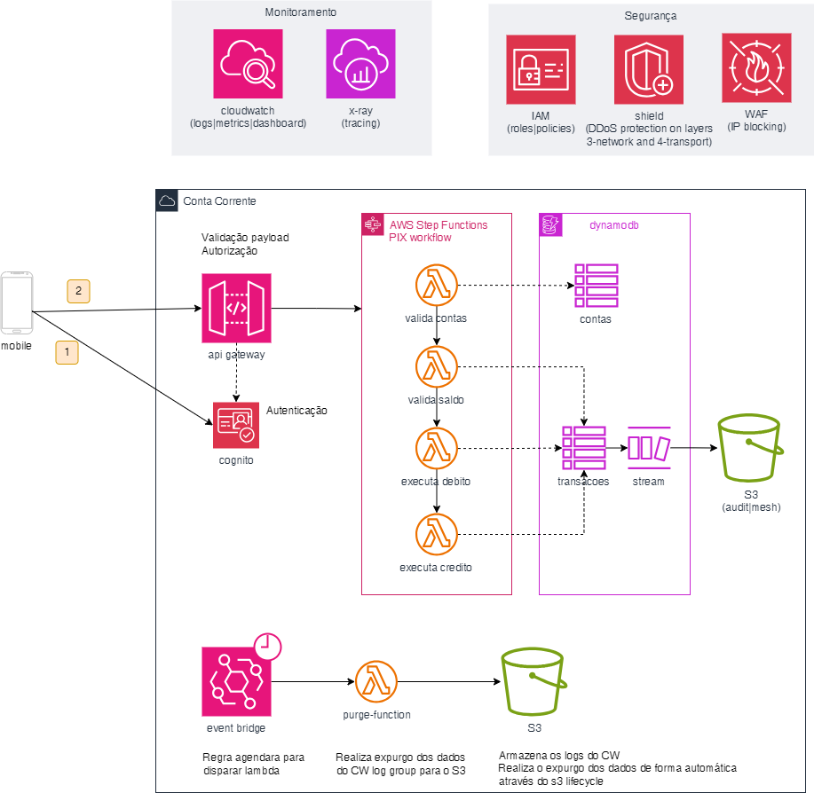
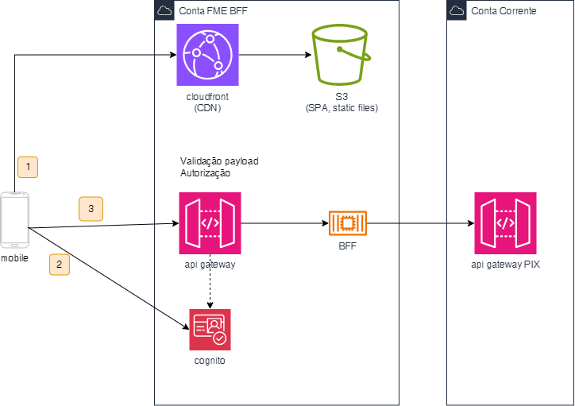

```
Você recebeu a missão de projetar a arquitetura do PIX dentro do Itaú e recebeu os seguintes requisitos funcionais e não funcionais:
O sistema deverá ser capaz de receber a ordem de transferência dos Apps e efetivar o débito(-) na conta do cliente solicitante antes de creditar (+) a conta do cliente destinatário.
O sistema deverá guardar um histórico de todas as transações por 5 anos.
Ser compatível com IOS e Android
Inicio com 100 transações diárias, com perspectiva de crescimento para 20 milhões por dia em até 1 ano
Ter ao menos 2 AZs
Ter log de metricas
Juntamente com os requisitos, você recebeu a proposta de arquitetura inicial. Faça as correções necessárias para que a solução possa atender os requisitos de forma efetiva, levando em consideração o custo benefício da solução.

Obs:
Requisitos de segurança não são obrigatórios, mas podem haver perguntas relacionadas.
FronEnd e Apps não fazem parte do escopo do desenho.
Não existe resposta certa ou errada, o objetivo do case é avaliar a linha de raciocínio dos candidatos.

```


### Opção 1


#### Pros
- Solução simples, com poucas peças
- Fácil manutenção e monitoramento

#### Cons
- A lambda pix-function não está coesa, e qualquer alteração no código representa um risco de falha da solução como um todo.
- Nao existe tabela de transação. As transações ficam somente nos logs.


### Opção 2


#### Pros
- As lambdas functions se tornaram mais coesas e estão sendo orquestradas pela ferramenta de worflows da aws.
- Tabelas separadas para Contas e Transações

#### Cons
- Solução de média complexidade, com algumas peças
- Monitoramento mais complexo, pois tem que monitorar mais peças


### Opção Evolução


Como evolução, ou complemento, das opções acima podemos adicionar o pattern Backends for Frontends (BFF). Assim não precisamos expor o endpoint do pix e temos a flexibilidade de adequar os contratos de acordo com o 'cliente' (mobile, web, etc).
